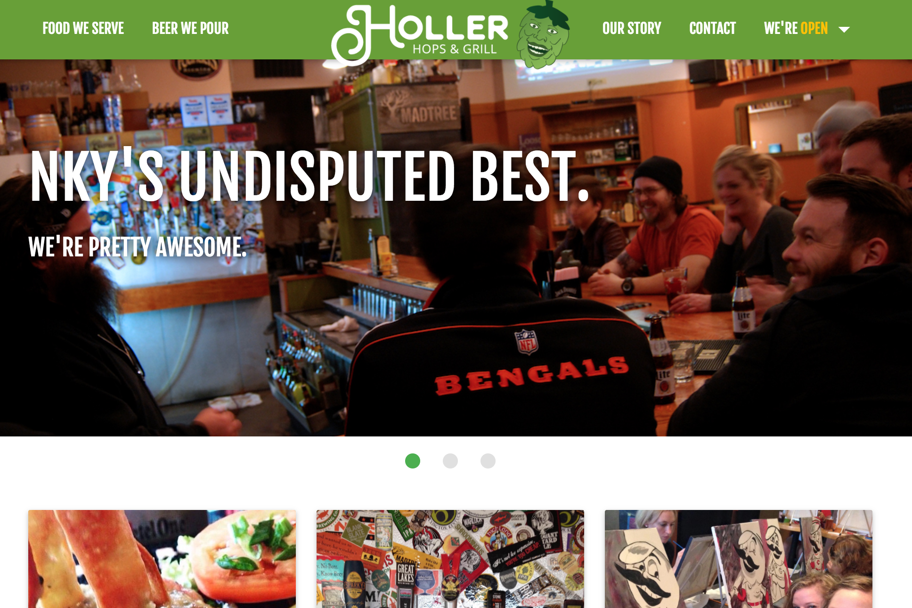

# Holler Hops
Source code for a local restaurant's website, [HollerHops.com](http://hollerhops.com). It's a tiny Express application that powers a menu and beer list with Google Spreadsheets instead of a database. It uses free hosting so be patient if it takes a second to load.

## How to run
1. `npm install`
2. `npm start`
3. Open browser to http://localhost:3000.